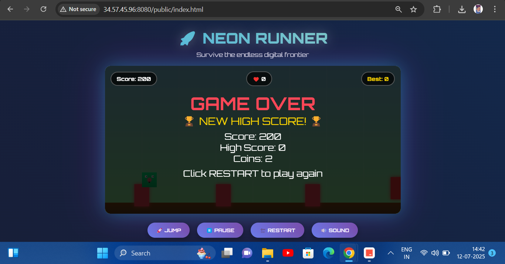

# HTML5 Arcade Game

## Description

This project is a modern HTML5 endless runner game. It features advanced graphics, a responsive UI, and is built with vanilla JavaScript. The game is containerized using Docker for easy deployment.

## Game Demo



## Tech Stack

- **Frontend:** HTML5, CSS, JavaScript
- **Containerization:** Docker
- **Development Server:** Node.js, http-server
- **Testing:** Jest
- **Linting:** ESLint
- **CI/CD:** GitHub Actions
- **Orchestration:** Kubernetes, Helm
- **GitOps:** Argo CD
- **Monitoring:** Prometheus, Grafana
- **Logging:** ELK Stack (Elasticsearch, Logstash, Kibana)
- **Infrastructure:** Terraform, GKE

# Complete Deployment Guide

This guide will walk you through the complete process of deploying the HTML5 Arcade Game from local development to production with monitoring and observability.

## Prerequisites

Before you begin, ensure you have the following installed:

- **Local Development:**
  - Node.js (v16 or higher)
  - npm (v7 or higher)
  - Docker (v20 or higher)
  - Git

- **Kubernetes Deployment:**
  - kubectl (v1.20 or higher)
  - Helm (v3.5 or higher)
  - Google Cloud SDK (if using GKE)
  - Terraform (v1.0 or higher, for infrastructure)

## Step 1: Local Development Setup

```bash
# Clone the repository
git clone https://github.com/sonbarse17/html5-arcade-game.git

# Navigate to project directory
cd html5-arcade-game

# Install dependencies
npm install

# Start development server
npm run dev
```

This will start a local development server at http://localhost:3000 where you can play the game and make changes to the code.

## Step 2: Testing and Building

```bash
# Run linting to check code quality
npm run lint

# Run tests to ensure functionality
npm test

# Build the application for production
npm run build
```

These commands validate your code and create a production-ready build in the `dist` directory.

## Step 3: Docker Containerization

```bash
# Build Docker image
docker build -t html5-arcade-game .

# Run Docker container locally
docker run -p 8080:80 html5-arcade-game
```

This containerizes your application, making it portable and ready for deployment. You can now access the game at http://localhost:8080.

## Step 4: Infrastructure Setup with Terraform

```bash
# Navigate to terraform directory
cd terraform

# Initialize Terraform
terraform init

# Create a terraform.tfvars file with your GCP project details
echo 'project_id = "your-gcp-project-id"' > terraform.tfvars
echo 'region = "us-central1"' >> terraform.tfvars

# Plan the infrastructure changes
terraform plan

# Apply the configuration to create GKE clusters
terraform apply
```

This step creates three GKE clusters (dev, test, prod) in your Google Cloud project. Terraform will:
1. Set up the necessary networking components
2. Create three separate Kubernetes clusters for different environments
3. Configure node pools with appropriate sizing for each environment
4. Output the cluster names and credential commands when complete

## Step 5: Kubernetes Deployment with Helm

```bash
# Configure kubectl to use the GKE clusters
gcloud container clusters get-credentials arcade-game-dev --region us-central1

# Navigate to helm directory
cd ../helm

# Deploy to development environment
./deploy.sh dev
```

This step deploys the application to the development Kubernetes cluster using Helm charts. The script:
1. Creates the necessary namespace
2. Applies the appropriate values for the environment
3. Installs the application with proper configuration
4. Sets up services and ingress for external access

To verify the deployment:
```bash
kubectl get all -n arcade-game-dev
```

## Step 6: Setting Up Continuous Deployment with Argo CD

```bash
# Navigate to argocd directory
cd ../argocd

# Install Argo CD
./install.sh
```

This installs Argo CD in your cluster. The script will:
1. Create the argocd namespace
2. Deploy all Argo CD components
3. Configure the Argo CD server
4. Output the server URL and initial admin password

Next, set up secrets for Docker Hub:
```bash
DOCKERHUB_USERNAME=your-username DOCKERHUB_PASSWORD=your-password ./setup-secrets.sh
```

This creates Kubernetes secrets containing your Docker Hub credentials for pulling private images.

Finally, deploy your applications to Argo CD:
```bash
./deploy.sh --environment all
```

This sets up GitOps-based deployments for all environments. Argo CD will:
1. Monitor your Git repository for changes
2. Automatically sync changes to the Kubernetes cluster
3. Provide a dashboard for deployment status and history

## Step 7: Setting Up Monitoring with Prometheus and Grafana

```bash
# Navigate to monitoring directory
cd ../monitoring

# Set up monitoring stack
./setup-monitoring.sh
```

This installs the monitoring stack in your cluster. The script:
1. Creates a monitoring namespace
2. Installs Prometheus for metrics collection
3. Installs Grafana for visualization
4. Configures ServiceMonitors to scrape metrics from your application
5. Sets up pre-configured dashboards for application monitoring
6. Outputs URLs and credentials for accessing the monitoring tools

## Step 8: Setting Up Logging with ELK Stack

```bash
# Navigate to elk directory
cd ../elk

# Set up ELK stack
./setup-elk.sh
```

This installs the ELK stack for centralized logging. The script:
1. Creates an elk namespace
2. Installs Elasticsearch for log storage
3. Installs Logstash for log processing
4. Installs Kibana for log visualization
5. Deploys Filebeat to collect logs from Kubernetes pods
6. Configures log parsing and indexing
7. Outputs URLs and credentials for accessing Kibana

## Step 9: Accessing Your Application

To access your application, you can use the ingress IP address:

```bash
# Get the ingress IP address
kubectl get ingress -n arcade-game-dev
```

For local access without ingress, use port-forwarding:
```bash
kubectl port-forward svc/arcade-game-dev 8080:80 -n arcade-game-dev
```

Then open http://localhost:8080 in your browser.

## Step 10: Promoting to Production

When you're ready to promote your application from test to production:

```bash
# Navigate to argocd directory
cd ../argocd

# Promote from test to production
./promote-image.sh --source test --target prod
```

This script:
1. Gets the current image tag from the test environment
2. Updates the production environment to use the same image tag
3. Triggers a sync in Argo CD to deploy the changes
4. Waits for the deployment to complete

To verify the production deployment:
```bash
kubectl get all -n arcade-game-prod
```

## Maintenance and Operations

### Updating the Application

When you make changes to your code:

```bash
# Commit and push your changes
git add .
git commit -m "Your changes"
git push origin main
```

Argo CD will automatically detect and deploy changes, or you can manually trigger a sync:
```bash
cd argocd
./deploy.sh --environment dev --sync
```

### Monitoring and Troubleshooting

To access Grafana dashboards:
```bash
kubectl port-forward svc/grafana 3000:80 -n monitoring
# Open http://localhost:3000 in your browser
```

To access Kibana for logs:
```bash
kubectl port-forward svc/kibana-kibana 5601:5601 -n elk
# Open http://localhost:5601 in your browser
```

To check application logs directly:
```bash
kubectl logs -f deployment/arcade-game-dev -n arcade-game-dev
```

### Scaling the Application

To scale your application manually:
```bash
kubectl scale deployment arcade-game-dev --replicas=3 -n arcade-game-dev
```

Or update the values file and apply with Helm/Argo CD for a more permanent change.

## Understanding the Components

- **Helm Charts**: Located in `helm/arcade-game`, these define how the application is deployed to Kubernetes with environment-specific configurations.

- **Terraform**: Located in `terraform/`, these files define the infrastructure as code, creating GKE clusters and networking.

- **Argo CD**: Located in `argocd/`, these files set up GitOps-based continuous deployment.

- **Monitoring**: Located in `monitoring/`, these files set up Prometheus and Grafana for metrics and dashboards.

- **ELK Stack**: Located in `elk/`, these files set up centralized logging with Elasticsearch, Logstash, and Kibana.

## Additional Resources

- [Helm Chart Details](helm/README.md)
- [Argo CD Setup Details](argocd/README.md)
- [Monitoring Setup Details](monitoring/README.md)
- [ELK Stack Details](elk/README.md)

---

Created by @Sushant Sonbarse
[GitHub](https://github.com/sonbarse17)